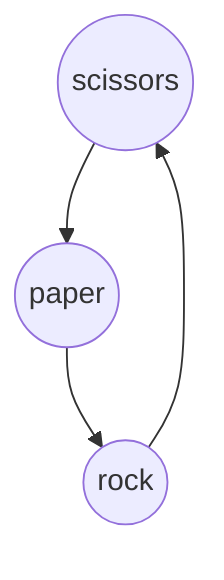
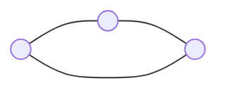
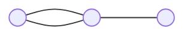
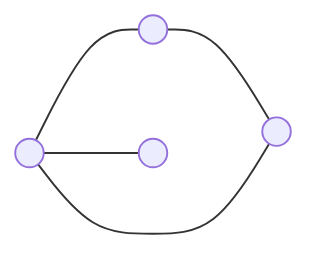
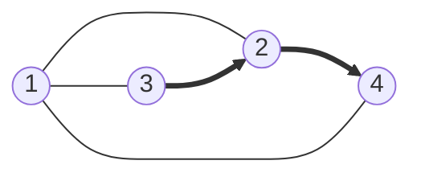
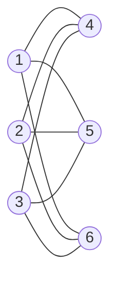

# 4011 Formal Language and Autonoma, Chapter 1
### Austin Lyksett
### Date: 2023-09-09

---
# [0.1]

## What are the fundamental capabilities and limitations of computers?

There are three areas that this is concerned with:
- Automata
- Computability
- Complexity

For each of these, this question is interpreted differently, starting from the end;


### Complexity Theory

Some problems easy (Sorting), some problems hard (Scheduling). _What makes some problems easy and some problems hard?_
We don't have a good answer to this but we have made systems to categorize different problems by how _hard_ they are.

Basically, is this problem easy or hard?

### Computability Theory

Computability theory discusses what computers can physically do. For example computers cannot prove mathematical statements (while humans can)

Like complexity theory, computability theory divides problem into ones that are *computable* or *not computable*.

### Automata Theory

Automata Theory deals with the definitions and properties of mathematical models of computation, these play roles in several applied areas of CS.

One example is *finite automaton*, used in text processing, compilers and hardware design. Another model is *context-free grammar*, used in programming languages and AI.


# [0.2]

## Mathematical Notions and Terminology

### Sets

Largely review
- A multiset is a set with repeat elements
- $\mathbb{N}$ -> ${ 0 , 1, 2, ...}$
- $\mathbb{Z}$ -> ${ ... -1, 0, 1, ...}$
- A set with two members is an *unordered pair*
- A *power set* is a set of all possible set in a set.
  - For example let $S = \{1, 2, 3\}$. The power set of $S$ would be:
    - $\{\empty\}$
    - $\{1\}$
    - $\{2\}$
    - $\{3\}$
    - $\{1, 2\}$
    - $\{1, 3\}$
    - $\{2, 3\}$
    - $\{1, 2, 3\}$
  - The size of a power set is $2^n$

If we want to describe a set containint elements according to some rule, we will write it as
$\{{n | rule\ about\ n}\}$ , thus $\{{n | n = m^2 for\ some\ m \in \mathbb{N}}\}$

- The complement of A, written ${A^\complement}$ is the set of all elements that are not in A.


### Sequences and Tuples

A *sequence* of objects in a list is an ordered list, usually written in parenthesis. Finite sequences are called Tuples. A 2-tuple is an *ordered pair*

If A and B are two sets, the *Cartesian Product* or *cross product* of these two sets is the set of all ordered pairs wherin the first element is a member of A and the second is a member of B.

***Example***

- If A = {1, 2} and B = {x, y, z},
  - A x B = {(1, x), (1, y), (1, z), (2, x), (2, y), (2, z)}
  

- The set $\mathbb{N}^2 = \mathbb{N} \times \mathbb{N}$ consists of all ordered pairs of natural numbers. We also may write it as {(i, j) | i, j >= 1}
  

### Functions and Relations

A function is a object that sets up an input-output relationship. In every function, the same input produces the same output. If f is a function whos output is b when the input is a, then we write it as:

$f(a)=b$

A function is also called a **mapping**, and, if $f(a)=b$, we say that $f$ maps a to b.

The set of possible inputs to a function is called its *domain*. The output of a function is caleld its range. The notion for saying that $f$ is a function with domain $D$ and range $R$ is

$f:\ D \rightarrow R $


In the case of the $abs$ function, if we're working with integers the domain and range are $\mathbb{Z} \rightarrow \mathbb{Z}$. For an addition function we would express it as $\mathbb{Z} \times \mathbb{Z}$.

$abs$ will never output all elements in it's range: $\mathbb{Z}$, a function that does use all elements in it's range is said to be *onto* the range.


***Example***

Consider the function $f: {0, 1, 2, 3, 4} \rightarrow {0, 1, 2, 3, 4}$.


| n   | f(n) |
| --- | ---- |
| 0   | 1    |
| 1   | 2    |
| 2   | 3    |
| 3   | 4    |
| 4   | 0    |

This function adds 1 to it's input and returns the result modulo 5.


Modular arithmatic is defined as $Z_m = {0, 1, 2, ..., m -1}$. With this notation, the previous function can be represented as

$f: \mathbb{Z_5} \rightarrow \mathbb{Z_5}$.


We can also define two dimentional funcitons as;

| g   | 0   | 1   | 2   | 3   |
| --- | --- | --- | --- | --- |
| 0   | 0   | 1   | 2   | 3   |
| 1   | 1   | 2   | 3   | 0   |
| 2   | 2   | 3   | 0   | 1   |
| 3   | 3   | 0   | 1   | 2   |

the function g is $g: \mathbb{Z_4} \times \mathbb{Z_4} \rightarrow \mathbb{Z_4}$


When the domain of a function $f$ is $A_1 \times  ... \times A_k$ for some sets $A_1 \times  ... \times A_k$, the input to $f$ is is a k-tuple $(a_1, a_2, ... , a_k)$. $a_i$ is the *argument* to $f$.

A function with k arguments is called a k-ary function and k is the *arity* of the function.

A **predicate** or **property** function is a function whos range is ${True, False}$.

A property whos domain is a set of k-tuples is called a *relation*, a *k-ary relation*, or a *k-ary relation on A*. A common case is the 2-ary relation, called a *binary relation*. For example the greater than or less than operators; $>, <, \leq, \geq$ which use *infix* notation.

***Example***

The game rock paper scissors can be expressed:

| beats    | rock  | paper | scissors |
| -------- | ----- | ----- | -------- |
| scissors | False | True  | False    |
| rock     | False | False | True     |
| paper    | True  | False | True     |


We can also express this relation in such a way;

${(scissors, paper), (paper, stone), (stone, scissors)}$

A special type of binary relation, called an *equivalence relation* captures the notion of two objects being equal in some feature. A binary relation R is an equivalence relation if R satisfies three conditions:
1. R is **reflexive** if for every $x,\ xRx$
   - That is, $x = f(x)$
2. R is **symmetric** if for every $x, y,\ xRy\ implies\ yRx$, and 
   - That is, 
    ```
        if x _ y, then y_x
   ```
   - Or that the function is "commutative"
3. R is **transitive** if for every $x, y\ and\ z, xRy\ and\ yRx\ implies\ xRz$
    - That is, if x _ y and y _ x, then x _ z
    - Or, if $\text{f(a) = b and f(b) = c then f(a) = c. For example if a = b and b = c then a = c}$.


### Graphs

Largely review.

Vocab:
- A *path* in a graph is a sequence of nodes connected by edges
- A *simple path* is a path that doesn't repeat any nodes
- A graph is *connected* if every two nodes have a path between them
- A path is a *cycle* if it starts and ends on the same node
- A *simple cycle* is one that connects at least three nodes and repeats only the first and last nodes.
- A graph is a *tree* if it is connected and has no simple cycles.
- A graph is *regular* if each vertex has the same number of neighbors.

We can represent rock, paper, scissors using a directed graph;



### Strings and languages

An ***alphabet*** is defined as any non-empty finite set. The members of this alphabet are considerd ***symbols***. Generally, an alphabet is denoted as $\sum$

A string is a collection of symbols over an alphabet. If w is a string over $\sum_1$, then the length of this string is written as |w|. A string of length zero is written as $\epsilon$


String z is a *substring of* s if it appears consecutively within s. For example "cad" is a substring of "acabradabra". 

*concatenation* of two strings is to append string x onto string y, for example let string a = "abc" and string b = "def". We can express concatenation by $ab$. To concatenate a string on itself k times we can write $x^k$.

*lexicographic* order of strings is the same as alphabetic order. Sometimes there will be a *shortlex* order, or *string order* that is identical to lexicographic order except that shorter strings come first.

A *proper prefix* is a string that is a prefix of another string that is not a repeat. Definied; $\text{x is a prefix of y if } \exists z \in \sum | xz = y\ and\ x \neq y$.
 
A *language* is a set of strings. A language is *prefix-free* if no member is a proper prefix of another member.

### Boolean Logic

System build around True, False.

We can manipulate boolean values with *boolean operations*;

- Negation/Not: $\neg$
- Conjunction/AND: $\land$
- Disjunction/OR: $\lor$
- Exclusive or, XOR: $\oplus$
  - 1 if either, but not both is 1
- Equality: $\leftrightarrow$
  - If both operands are 1
- Implication: $\rightarrow$
  - 0 if first operand is 1 and second is 0, otherwise $\rightarrow is 1$.

| operand           | 00  | 10  | 01  | 11  |
| ----------------- | --- | --- | --- | --- |
| $\oplus$          | 0   | 1   | 1   | 0   |
| $\leftrightarrow$ | 1   | 0   | 0   | 1   |
| $\rightarrow$     | 1   | 0   | 1   | 1   |


We can express all of these with simply AND and NOT, see

| Operation             | Expansion                                    |
| --------------------- | -------------------------------------------- |
| $P\wedge Q$           | $\neg (\neg P \land \neg Q)$                 |
| $P \rightarrow Q$     | $\neg P \wedge Q$                            |
| $P \leftrightarrow Q$ | $(P \rightarrow Q) \wedge (Q \rightarrow P)$ |
| $P \oplus Q$          | $\neg(P \leftrightarrow Q)$                  |


Boolean algebra also follows the distributive law.


# [0.3]
## Definitions, Theorems and Proofs

- Definitions describe objects or notions that we use, for example *set* from before.
  - After we have definitions, we create *mathematical statements* about them. Typically a statement expresses some property of a the object or notion.
- A *proof* is an airtight mathematical argument
- A *theorem* is a *proved* statement
  - If we prove a statement and we use it in assistance for another, larger proof, we consider it a *lemma*.
- If a theorem or proof allows us to conclude another related statement is true we call that a *corallary* of the theorem.

## Finding Proofs

Carefully read the statement you want to prove, fully understand it.
   1. Sometimes a statement is actually multiple statements, for example a common one has the form "P if and only if Q", written as P iff Q where both P and Q are mathematical statements. This notion is shorthand for a two part statement.
      1. The first part is "P only if Q" which means "if P is true, THEN Q is true", written as $P \Rightarrow Q$
      2. The second part is "P if Q" which means; if Q is true, then P is true, written as $P \Leftarrow Q$.
      3. The first part of these is the "forward direction" of the original statement and the second part is the "reverse direction". We write "P iff Q" as $P \Leftrightarrow Q$
      4. To prove a statement of this form we must prove both the forward and reverse direction.
      5. So, in "P iff Q", you need to prove if P then Q, and if Q then P
   2. Sometimes in sets you need to prove equality, for example prove A = B
      1. A common way to do this is to prove $\forall x \in A, x \in B\ and\ \forall y \in B, y \in A$
   3. Another way is to get some sort of "gut" feeling. Experiment with examples and observe properties. Then try to come up with an object that fails to have that property, called a *counterexample*. If the statement actually is true, you won't be able to find such an example.

#### Examples:
##### Prove, for every graph $G$, the sum of all the degrees of all nodes in $G$ is an even number.

1. Experiment and develop a gut feeling:



Each of these nodes is of degree 2.



Each of these is also of degree 2.



One of these nodes is of degree 3, and another is degree 1. Each time an edge is added it connects 2 nodes together, therefore the total degree of all nodes is increased by 2 for every edge.

Every edge in $G$ is connected to two nodes. Each edge contributes 1 to the degree of each node. Since an edge connects only 2 nodes, therefore each edge contributes 2 to the total degree of all nodes. Therefore, the sum degree of $G$ can be expressed as $2n$ where $n$ is the number of nodes in $G$


##### Prove, for any two sets A and B, $(\overline{A \cup B }) = \overline{A} \cap \overline{B}$

1. Is the meaning of the statement clear? 
   1. What does each symbol and statement mean?
      1. $\cup$ means union 
      2. $\cap$ means union 
      3. $\overline{A}$ means every element not in A
   2. What is the meaning of the statement?
      1. $(\overline{A \cup B })$
         1. $A \cup B$ is a set that includes every element of A or B
         2. $(\overline{A \cup B })$ then means any element that is not included in either A or B.
      2. $\overline{A} \cap \overline{B}$
         1. $\overline{A}$ Is every element that is not in A
         2. $\overline{B}$ Is every element that is not in B
         3. $\cap$ is the intersection between these, what the two share.
      3. So, "Every element that is not included in either A or B is equal to the intersection between every element that is not in A, AND is not in B"
   3. We can now prove this via an element proof (Show that for every element of one set, it is also an element of another)
   
$\forall a \in \overline{A}, a \notin A.\ \forall b \in \overline{B}, b \notin B.$ Therefore, the set formed by $\overline{A} \cap \overline{B}$ contains no element that are within $A\cup B$ The set containing all element that are not within $A\cup B$ can be expressed by $(\overline{A \cup B })$.

# [0.4]
## Types of proofs
Here we will conver some common types of proofs that often arrive in the theory of computation. Note a proof may contain more than one type of argument because the proof may contain within it several types of proofs.
### Proof by Construction

Many theorems state that a particular type of object exists. One way to prove such a theorem is to demonstrate how to construct that object, this is called a *proof by construction*

Let's use proof by construction to prove the following:
##### We define a graph to be *k-regular* if every node in the graph has degree k

For each even number n greater than 2, there exists a 3-regular graph with n nodes.

Let n be an even number greater than 2. Construct graph G = (V, E) with n nodes as follows. The set of nodes of G is V = {0, 1, . . . , n − 1}, and the set of edges of G  is the set;


$ E = \{\{i,i+1\}\ |\ for\ 0 \leq i \leq  n-2\}$

$ \cup $

${\{ n-1,0 \}}$

$ \cup $

$\{\{i,i+n/2\}\ |\ for\  0 \leq i \leq n/2-1\}$


Imagine this constructing a graph with nodes around the circumfrence of a circle, each node is connected to it's neighbors and the one directly accross from it.

### Proof by Contradiction

We can assume a theorem is false, then show that this assumption leads to an obviously false consequence, called a contradiction.

For example,

Jack sees Jill come inside, she is not wet, therefore it is not raining. He can prove by contradiction, in that if it were raining (assume false), then she would be wet. Since she is not wet and we're assuming that it is raining, the conclusion is false. Therefore Jack knows it is not raining.


Prove the square root of 2 is irrational.

Define a rational number to be the the division of two integers. Assume that the square root of 2 is rational, that would mean that 
$\frac{m}{n} = \sqrt{2}$
for some integers m, n. We can re-write this to be 
$m = \sqrt{2}n$

We can then square both sides to obtain 
$ m^2 = 2n^2$.

Since $m^2$ is 2 times $n^2$, we know that $m^2$ is even by the definition of an even number. We can then write $m = 2k$ for some integer k, giving us

$2n^2 = 2k^2 = $
$2n^2 = 4k = $
$n^2 = 2k$

Which means that n is an even number since an even number times an even number is also even.

Since we established previously that one of m, n is odd, and that m is even, there is now a contradiction.

### Proof by Induction

We use proof by Induction to show that all elements have a particular property

There are a few components of this method; The basis and the induction step.

The basis step is to prove some property, P is true for 1... P(1).


The induction step is to then show this property applies to P(i+1) if P(i). To prove rigourously, one would have to show that P(1...i) for every i. The *induction hypothesis* is used to show that P(i) is true for any i. The following form is used for induction;

1. Basis. Prove P(1)
2. Induction: For each $i \geq i$, assume P(i) is true and use this assumption to show that P(i+1) is true.


# Exercises
## 0.7
### Give a relation that satisfies the condition
   
- Reflexive: xRx = True
  - $=$
  - $\leq$
  - $\geq$
  - Divides
- Symmetric: xRy = yRx
  - $=$
  - $\mathbb{Z} + \mathbb{Z} \sub \mathbb{Z}$
- Transitive: xRy = True, yRz = True, then xRz = True
  - $A \sub B, B \sub C, A \sub C $
  - 
   
 1. Reflexive and symmetric but not transitive
    1. x has slept with y
    2. x lives within 1 mile of y
    3. ?
 2. Reflexive and Transitive but not symmetric
    1. $\sub $
 3. Symmetric and Transitive but not Reflexive
    1. $X=\{0,1,2\}\text{ and let the relation be }\{(0,0), (1,1), (0,1), (1, 0)\}$


## 0.8
### Draw the graph
Consider the undirected graph G= (V, E) where V , the set of nodes, is {1, 2, 3, 4}
and E, the set of edges, is {{1, 2}, {2, 3}, {1, 3}, {2, 4}, {1, 4}}. Draw the
graph G. What are the degrees of each node? Indicate a path from node 3 to
node 4 on your drawing of G.




## 0.9
### Write a formal description of this graph



$G = \{(1,4), (1,5), (1,6), (2,4), (2,5), (2,6), (3,4), (3,5), (3,6)\}$
