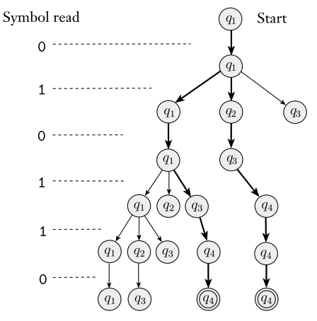

# 4011 Formal Language and Automata, Chapter 1
### Austin Lyksett
### Date: 2023-09-12

---

# Finite Automata

Imagine an automatic door that opens for a person if they're on the correct side:


|        | NEITHER | FRONT | BOTH   | BOTH   |
| ------ | ------- | ----- | ------ | ------ |
| closed | closed  | open  | closed | closed |
| open   | closed  | open  | open   | open   |


This controller, machine, only uses a single bit of memory, capable of recording what one of two states the machine is in.

We will define a finite automaton to be a 5-tuple.

A transition function, $\delta$, defines the rules for moving. For example if we have a state that will go from x to y if 1, then $\delta$ will look like $\delta(x, 1)$.

## Definition 1.5
| A finite automata is a 5-tuple. ($Q, \sum, \delta, q_0, F$ where)     |
| --------------------------------------------------------------------- |
| 1. $Q$ is a finite set called the *states*                            |
| 2. $\sum$ is a finite set called the *alphabet*                       |
| 3. $\delta: Q \times \sum \rightarrow Q$ is the *transition function* |
| 4. $q_0 \in Q$ is the *start state*                                   |
| 5. $F \subseteq Q$ is the *set of accept states*                      |


Let's try to define the following state diagram formally;


$ Q=\{q1, q2, q3\}, \sum=\{0,1\}, \delta =[1], q_0 = q1, F = q2$

$[1]$
| $\delta$ | 0   | 1   |
| -------- | --- | --- |
| q1       | q1  | q2  |
| q2       | q3  | q2  |
| q3       | q2  | q2  |


If A is the set of all strings the language will accept, then we define A to be the ***language of machine M***, and write L(M) = A. We say that ***M Recognizes A, or M accepts A*** 

So for the above machin, we can define the language to be:
$$A = \{w | w \text{contains at least one 1 and an even number of zeros follow the last 1}\}$$

Then $L(M_1)=A$, or $M_1$ recognizes A.


## Formal definition of Computation

Let's formalize a finite automata.

Let M = $ Q, \sum, \delta, q_0, F$ be a finite automata and let $w =\{w_1, w_2, ...,  w_n\}$ be a string where each $w$ is a member of the alphabet $\sum$. 

M accepts w if a sequence of states 

$\{r_1, r_2, ...,  r_n\}$ in $Q$ exists with three conditions:
1. $r_0 = q_0$
2. $\delta(r_i, w_i) = r_i+1$ for $i=0,...n-1$ and
3. $r_n \in F$. 

Translated:
1. The start state is where the machine starts
2. The next state will occur
3. The final state is in one of the accepting states.
   
### Definition 1.16
| A language is called a ***regular language*** if some finite automataton recognizes it |
| -------------------------------------------------------------------------------------- |

## Designing Finite Automata

### String contains 001?

Designing an automata can be hard, try putting yourself in the position of the machine. This is called "reader as automation". Suppose you are given some language and want to deisgn a finite automata that recognizes it. 
- You get to see the input singals one by one
- After each symbol, decide whether the string so far is in the languge


Let's say you want to define an automata that will return True if the string contains "001".

There are four possibilities:
1. You haven't seen any symbols
2. you've just seen a 0
3. you've just seen a 00
4. you've seen the enture pattern 001

Let's assign states to these four patters;
$q, q_0, q_00, q_001$

From my point of view:
```
1. Accept a symbol from the starting state
   1. if it's a 1 then it can't be in our accepting state
   2. if it's a 0 then it could be in our accepting state
      a. if this is a 1 then it's not in our accepting state, go back to [1]
      b. if this is a 0 then it could be in our accepting state
            k. At this point, we've seen 2 zeros. If there is a 1 from now until the
               end of the tape the we've reached our accepting state.
            j. if 1, then stay here.
```

Now let's draw a diagram for it


---
### String contains even or odd number of ones?
What about an automata that returns whether a string contains an odd number of ones 

- We can just keep track of of the number of 1's so far is even or odd and return that.


States:
  1. Even
     1.  if 0, stay
     2.  if 1, odd
  2. Odd
     1. if 0, stay
     2. if 1, even
   


## The Regular operations

In normal arithmatic, the regular operations are tools for manupulating values, +, -, x etc...

In languages, we define three operations, called ***regular operations***

### Definition 1.23
| Let A and B be languages, we define the regular operations, *union, concatenation, and star as follows* |
| ------------------------------------------------------------------------------------------------------- |
| - Union: $ A \cup B = \{x\|x \in A\ or\ x \in B\} $                                                     |
| - Concatenation: $A \circ B = \{xy\|x \in A\ and\ y \in B\}$                                            |
| - Star: $A^* = \{x_1,x_2,...x_k\|k \geq 0\ and\ each\  x_i \in A\}$                                     |

- Union is like normal, it just lumps all symbols together
- Concatenation attaches a string from A to a string from B in all possible ways to get the strings in the new language.
- Star operator just attaches any number of strings together from A to get a new string for the new language (note $\epsilon$ is in this set as well).
  

##### Example:
let the alphabet $\sum$ be the standard 26 letters. If A = {good, bad} and B = {boy, girl}, then
- $A \cup B$ = $\text{\{good, bad, boy, girl\}}$
- $A \circ B$ = $\text{\{goodboy, goodgirl, badboy, badgirl\}}$
- $A^*$ = $\{\epsilon\text{, good, goodgood, goodbad, badbad, goodgoodgood, goodgoodbad, goodbadbad ... }\}$

If $\mathbb{N}$ are natural numbers, they are closed under multiplication, addition and subtraction, but not division.
    `- closed: the result of some operations of two elements from the set still resides in that set`
Regular languages are closed under these regular operations.


#### Proof for $A_1 \cup A_2$ being closed under $A$


We need to construct some $M$ that recognizes $A_1 \cup A_2$ where m = $ (Q, \sum, \delta, q_0, F)$.

That is, we need to fill out a table of each element in a machine:


| component | description                                                                                                                                                                                                       |
| --------- | ----------------------------------------------------------------------------------------------------------------------------------------------------------------------------------------------------------------- |
| $Q$       | $Q_1 \times Q_2$                                                                                                                                                                                                  |
| $\sum$    | $\sum_1 \cup \sum_2$                                                                                                                                                                                              |
| $\delta$  | $\forall a \in \sum,\ \ \ \delta((r_i, r_j), a) = (\delta_1(r_1,a),\delta_2(r_2, a))$. "Gets a cur state as a tuple, go to next a"                                                                                |
| $q_0$     | pair of $q_1,q_2$                                                                                                                                                                                                 |
| $F$       | $(F_1 \times Q_2)\cup (Q_1 \times F_2)$ Note this is not $F_1 \times F_2$ since that would give us only the states that $M_1$ AND $M_2$ accept. We want the accept states where both and either accepts are true. |

Therefore the union of two regular languages is also regular.


Now to show that concatenation is closed.


#### Proof for $A_1 \circ A_2$ being closed under A

To show: That $A_1 \circ A_2$ is regular given that $A_1$ and $A_2$ are both regular.

We know that $A_1 \circ A_2$ is composed of words from $A_1, A_2$ (For example, {good, bad} {boy, girl} = {goodboy, goodgirl, badboy, badgirl}).

We need to show that a machine $M$ will accept the concat. We know that each string is composed of each respective element (_good_ + _boy_) and that each machine $M_1, M_2$ will accept these, so combining them together will accept the concat, but ***how do we know when one string stops and the other starts***


We can solve this using ***non-determinism***!

---

# Non-determinism

---

The main difference between a DFA and NFA is that a state may have more than one exiting arrow. As a reminder, a DFA has one and only one exiting arrow from a state *for every symbol in an alphabet*.

For example, this is a nondeterministic finite automata:


How does this compute? Let's say for a NFA $N$ we're in state $n$. $n$ has two exiting arrows, each for $a$.
   - If the next symbol is $a$, then create a duplicate of the machine and traverse each pathway in parallel.
   - If all copies of an NFA are denoted $\mathbb{N}$, then $\forall N \in \mathbb{N}, \text{ if } (r_N)_n \in F_N$, then all machines will stop and the string will be accepted for the NFA.
   - if $\epsilon$ is encountered, then the machine will split.
   

This can be modeled as a tree;


[The tree for 010110 on machine $N_1$]

---

```
{"type":"NFA","nfa":{"transitions":{"start":{"0":["s0"],"1":["s0"],"ϵ":[]},"s0":{"0":[],"1":["s1"]},"s1":{"0":["s2"],"1":["s2"],"ϵ":[]},"s2":{"0":["s4"],"1":["s4"],"ϵ":[]}},"startState":"start","acceptStates":["s4"]},"states":{"start":{},"s0":{"top":332,"left":228,"displayId":"q1"},"s1":{"top":328,"left":403,"displayId":"q2"},"s2":{"top":329,"left":649,"displayId":"q3"},"s4":{"isAccept":true,"top":330,"left":870,"displayId":"q4"}},"transitions":[{"stateA":"start","label":"0","stateB":"s0"},{"stateA":"start","label":"1","stateB":"s0"},{"stateA":"s0","label":"1","stateB":"s1"},{"stateA":"s1","label":"0","stateB":"s2"},{"stateA":"s1","label":"1","stateB":"s2"},{"stateA":"s2","label":"0","stateB":"s4"},{"stateA":"s2","label":"1","stateB":"s4"}],"bulkTests":{"accept":"","reject":""}}
```
https://automatonsimulator.com/

Let A be the language consisting of all strings over {0,1} containing 1 in the third position from the end (...1..] This is the four state diagram of this:

This accepts the language A.


GUESS: What language would this machine accept?


```
{"type":"NFA","nfa":{"transitions":{"start":{"0":["s0"],"1":["s0"],"ϵ":[]},"s0":{"0":[],"1":["s1"]},"s1":{"0":["s2"],"1":["s2"],"ϵ":[]},"s2":{"0":["s4"],"1":["s4"],"ϵ":[]}},"startState":"start","acceptStates":["s4"]},"states":{"start":{},"s0":{"top":332,"left":228,"displayId":"q1"},"s1":{"top":328,"left":403,"displayId":"q2"},"s2":{"top":329,"left":649,"displayId":"q3"},"s4":{"isAccept":true,"top":330,"left":870,"displayId":"q4"}},"transitions":[{"stateA":"start","label":"0","stateB":"s0"},{"stateA":"start","label":"1","stateB":"s0"},{"stateA":"s0","label":"1","stateB":"s1"},{"stateA":"s1","label":"0","stateB":"s2"},{"stateA":"s1","label":"1","stateB":"s2"},{"stateA":"s2","label":"0","stateB":"s4"},{"stateA":"s2","label":"1","stateB":"s4"}],"bulkTests":{"accept":"","reject":""}}
```
https://automatonsimulator.com/

It *should be* a machine that accepts any language that has a 1 in it?


---

Another NFA


[Simulated](https://automatonsimulator.com/#%7B%22type%22%3A%22NFA%22%2C%22nfa%22%3A%7B%22transitions%22%3A%7B%22start%22%3A%7B%22a%22%3A%5B%5D%2C%22b%22%3A%5B%5D%2C%22%CF%B5%22%3A%5B%5D%2C%22%22%3A%5B%22s3%22%5D%7D%2C%22s1%22%3A%7B%22a%22%3A%5B%22s1%22%2C%22s2%22%5D%2C%22b%22%3A%5B%22s2%22%5D%7D%2C%22s2%22%3A%7B%22a%22%3A%5B%22s3%22%5D%7D%2C%22s3%22%3A%7B%22b%22%3A%5B%22s1%22%5D%2C%22%CF%B5%22%3A%5B%22s2%22%5D%7D%7D%2C%22startState%22%3A%22start%22%2C%22acceptStates%22%3A%5B%22s3%22%5D%7D%2C%22states%22%3A%7B%22start%22%3A%7B%7D%2C%22s3%22%3A%7B%22isAccept%22%3Atrue%2C%22top%22%3A338%2C%22left%22%3A160%2C%22displayId%22%3A%22q1%22%7D%2C%22s1%22%3A%7B%22top%22%3A123%2C%22left%22%3A402%2C%22displayId%22%3A%22q2%22%7D%2C%22s2%22%3A%7B%22top%22%3A342%2C%22left%22%3A632%2C%22displayId%22%3A%22q3%22%7D%7D%2C%22transitions%22%3A%5B%7B%22stateA%22%3A%22start%22%2C%22label%22%3A%22%CF%B5%22%2C%22stateB%22%3A%22s3%22%7D%2C%7B%22stateA%22%3A%22s1%22%2C%22label%22%3A%22a%22%2C%22stateB%22%3A%22s1%22%7D%2C%7B%22stateA%22%3A%22s1%22%2C%22label%22%3A%22a%22%2C%22stateB%22%3A%22s2%22%7D%2C%7B%22stateA%22%3A%22s1%22%2C%22label%22%3A%22b%22%2C%22stateB%22%3A%22s2%22%7D%2C%7B%22stateA%22%3A%22s2%22%2C%22label%22%3A%22a%22%2C%22stateB%22%3A%22s3%22%7D%2C%7B%22stateA%22%3A%22s3%22%2C%22label%22%3A%22b%22%2C%22stateB%22%3A%22s1%22%7D%2C%7B%22stateA%22%3A%22s3%22%2C%22label%22%3A%22%CF%B5%22%2C%22stateB%22%3A%22s2%22%7D%5D%2C%22bulkTests%22%3A%7B%22accept%22%3A%22baba%22%2C%22reject%22%3A%22%22%7D%7D)


---

Now how do we formally express a NFA? 
- It's quite similar to DFA, but namely the transition function is different. Instead of there being a current state, current symbol and next state there is instead
  - Current state, current symbol *or no symbol*, and a *set of next potential states*
  
For any set Q, we write $P(Q)$ to be the collection of all subsets of $Q$. Here, $P(Q)$ is called the *power set* of Q.

For any alphabet $\sum$ we write $\sum_\epsilon$ to be $\sum \cup \{\epsilon\}$. Now we can write the formal description of the type of the transition function in an NFA as:
- $\delta : Q \times \sum_\epsilon \longrightarrow P(Q)$


| A nondeterministic finite automata is a 5-tuple. ($ Q, \sum, \delta, q_0, F$)          |
| -------------------------------------------------------------------------------------- |
| 1. $ Q$ is a finite set called the *states*                                            |
| 2. $\sum$ is a finite set called the *alphabet*                                        |
| 3. $\delta : Q \times \sum_\epsilon \longrightarrow P(Q)$ is the *transition function* |
| 4. $ q_0 \in Q$ is the *start state*                                                   |
| 5. $ F \subseteq Q$ is the *set of accept states*                                      |

Recall $N_1$:


The formal description of this would be:

| component | Result              |
| --------- | ------------------- |
| $Q$       | $\{q1,q2,q3,q4\}$   |
| $\sum$    | $\{\epsilon, 0,1\}$ |
| $\delta$  | $[1]$               |
| $q_0$     | $q1$                |
| $F$       | $q4$                |


| $\delta$   |    q1    |    q2    |    q3    |    q4    |
| ---------- | :------: | :------: | :------: | :------: |
| $\epsilon$ | $\empty$ |    q3    | $\empty$ | $\empty$ |
| 0          |    q1    |    q3    | $\empty$ |    q4    |
| 1          | {q1, q2} | $\empty$ |    q4    |    q4    |

Proof Idea:
- If a language is recognized by a NFA then we must show it can also be recognized by an NFA. How do we do this?

- If an NFA has k-states, then it has $2^k$ sets of substates, each one being a possility of an NFA's execution.


```


```
