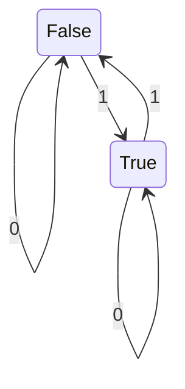

# 4011 Formal Language and Autonoma
### Austin Lyksett
### Date: 2023-09-06

---


Course page: z.umn.edu/4011

---

### Filters

__Decision Problem__

Input: binary string

Output: (bool) does input have odd number of ones?


- Boolean variable is the "state" of the filter.
    - True if odd number of ones, odd else

    ``` 
    // Filter
    odd := false
    while b := readbit() do:
        if b then odd := ~odd
    return state
    ```
    Linear time & Constant space

`odd` gives _meaning_ in the program-- semantic understanding of the problem.

__How do we formalize a filter?__



This is called a deterministic finite autonoma (__DFA__)

Deterministic- Given some state A, there is exactly one resulting state from A

---

### How do we define a DFA?

Finite set of states, `Q` 


Alphabet, $\sum$ (Fininte)


Transition Function, $\delta$: Q x $\sum$ -> Q

Start set, $q_0$ -> $\in$ `Q`

Accepting states, F $\subseteq$ Q

...

DFA M = (Q, $\sum$, $\delta$, $q_0$, F)

Q = <False, True>
$q_0$ = False
F = {True}

Table for transition function, this represents the "diagram" above.

X -> $\delta$

|Q|0|1|
|---|---|---|
|False|False|True   
|True|True|False


$\delta$(True, 1) -> False

This runs in constant time.


