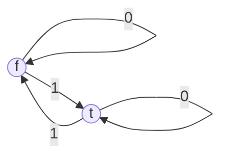
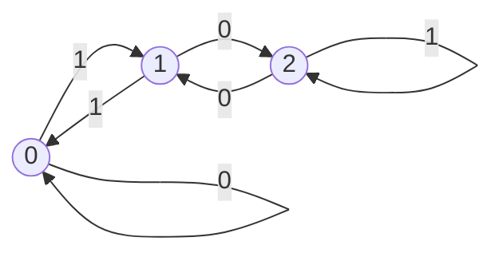

# 4011
### Austin Lyksett
### Date: 9-11-2023

---

Command line heros

#### Define DFA

- M = ($Q, \sum, \delta, q_0, F$)
- $\sum$ = finite alphabet (fixed size chunks of data)
- $\delta$ : Q x $\sum$ $\rightarrow$ Q (Transition function: current state, next symbol, next state.)
- $q_0 \in Q$: (initial state)
- $f \subseteq Q$ (Accepting states: output "yes" at end of computation. Q/F: rejecting states: output "no")
  

***Filter state diagram***
    - *Have we seen an odd number of ones so far?*

$\sum$ = set of all strings in alphabet

This filter will accept or reject the input.

Rejected -> False if the machine halts.

The number of states is exponential in this diagram

---

- Strings are not quoted from this point on
- Empty string is $\epsilon$
  
  For a binary alphabet:

$\sum$ = {0,1}

This machine accepts (L(M)) = {1, 01, 10, 001, 010, 100, 111 ... }. This set of strings is called a language

"L(M) = language accepted by machine M"

**M = decision problem's representation.**

Define: M accepts W $\in \sum^*$

The string w = w1, w2 ... wn . $w_i \in \sum$

iff $\exist r0 ... rn \in Q$
1. r0 = q0
2. rn $\in$ F
    1. i.e r0 -> r1 reads w1, r1 -> r2 reads w2
 3. 1 <= i >= n $\delta( ri-1, w) = r_i$

Def L(M) = $\in \sum | M\ accepts\ w$
- Or in formally, L(M) is the subset of accepted strings in the filter.

Meaning has no utility, only is good in that it provides a simple description of something

Each state with one arrow leaving it for each symbol in the alphabet is determinitstic.

---
Page 47

- Read input of decimal alphabet. Is the final number divisible by 3?

$\sum\ = {0,1}$
w = string of digits
state = {0, 1}

define N as the number of chars in the string we've read.
define current state as N mod 3
define N' as N concatenate N+1

The next state would be N' mod 3.

"how does N mod 3 change when you append a new digit"

These take the form of $(3k+1)$
| $\delta$ | 0   | 1   |
| -------- | --- | --- |
| 0        | 0   | 1   |
| 1        | 2   | 0   |
| 2        | 1   | 2   |

---

Most problems are unsolvable via diagonalization of a language, but we have finite programs.

Define *language* B $\subseteq \sum$ is regular iff there exists a DFA M where L(M) = B

Regular expressions are closed under union

Theorem: $\text{if B and C are regular, then B} \cup \text{ C is regular.}$

Proof:

let L(Mb) = B, L(Mc) = C

Show that there exists a union betwen B, C such that L(BuC) = BuC

Don't rely on meaning (intuition) to solve things

To union two machines, create a tuple of possible states and compute both, the result will prodive the new tuple state.

Create the elements for each, to get the new union machines elements just cross product each set, and tuple single sets.

The transition function; $(\delta(x,y), \sigma), = (\delta_B)(x,\sigma),\delta_c(y,\sigma), y\ \in F_c$

- up to 47, hard on 45/6

