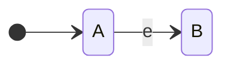

# 4011 Formal Language and Autonoma
### Austin Lyksett
### Date: 2023-09-13

---


### Definition 1.23
| Let A and B be languages, we define the regular operations, *union, concatenation, and star as follows* |
| ------------------------------------------------------------------------------------------------------- |
| - Union: $ A \cup B = \{x\|x \in A\ or\ x \in B\} $ This is akin to +                                                      |
| - Concatenation: $A \circ B = \{xy\|x \in A\ and\ y \in B\}$ This is akin to *                                           |
| - Star: $A^* = \{x_1,x_2,...x_k\|k \geq 0\ and\ each\  x_i \in A\}$ This is akin to repitition                                     |


| A finite automata is a 5-tuple. ($ Q, \sum, \delta, q_0, F$)          |
| --------------------------------------------------------------------- |
| 1. $ Q$ is a finite set called the *states*                           |
| 2. $\sum$ is a finite set called the *alphabet*                       |
| 3. $\delta: Q \times \sum \rightarrow Q$ is the *transition function* |
| 4. $ q_0 \in Q$ is the *start state*                                  |
| 5. $ F \subseteq Q$ is the *set of accept states*                     |


---

- Decision problem: "All the inputs (strings) which are true for the machine"-- Is this solvable by a filter (DFA)?

- When mapping a set of strings to booleans, the set of all True results can be considered a language

If B and C are regular, then B $\cup$ C is also regular

Combing $M_B, M_C$ into $M_{B\cup C}$ represents B $\cup$ C 

---

##### Example:
let the alphabet $\sum$ be the standard 26 letters. If A = {good, bad} and B = {boy, girl}, then
- $A \cup B$ = $\text{\{good, bad, boy, girl\}}$. Empty set is the identity.
- $A \circ B$ = $\text{\{goodboy, goodgirl, badboy, badgirl\}}$. $\epsilon$ is the identity operator. Not commutative
- $A^*$ = $\{\epsilon\text{, good, goodgood, goodbad, badgood, badbad, goodgoodgood, goodgoodbad, goodbadbad ... }\}$. $\epsilon$ is the identity operator

---
#### Non-Determinism


Thm. If B, C $\subset \sum^*$ are regular, then B $\circ$ C is regular.

To prove this, we need to get rid of determinism because we need to branch between both machines instead of running a single path.


#### *NFA*
- Nondeterministic-finite-automata

You can simulate an NFA with a DFA
Abandon : 
- $\delta:\  Q \times \sum \rightarrow Q$

Start : 
- $\delta:\ Q \times \sum \rightarrow P(Q)$
  - P(Q) is the power set of Q
- $\delta(q, \sigma)$ = set of states with transition function from Q to _, labeled with $\sigma$

$\epsilon-transitiion$:



- Instead of writing $\sum \cup \{\epsilon\}$ we will write $\sum_\epsilon$


Now using NFA's, the state diagram would be a n-ary tree where n in len(alphabet) + 1


P. 48 for machine


to combine two machines, for every accepting state in machine A, connect it to the starting state of machine B using $\epsilon$ transition function.


Now what strings that exist in the concatenated language? All languages of machine A of course, as well as a string in A that is directly followed by an accepted string for machine B


We can also use a NDA to model the union. Create some start state, epsilon them to each machines starting state.

```


```
