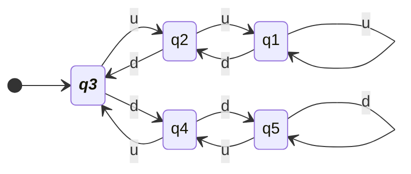
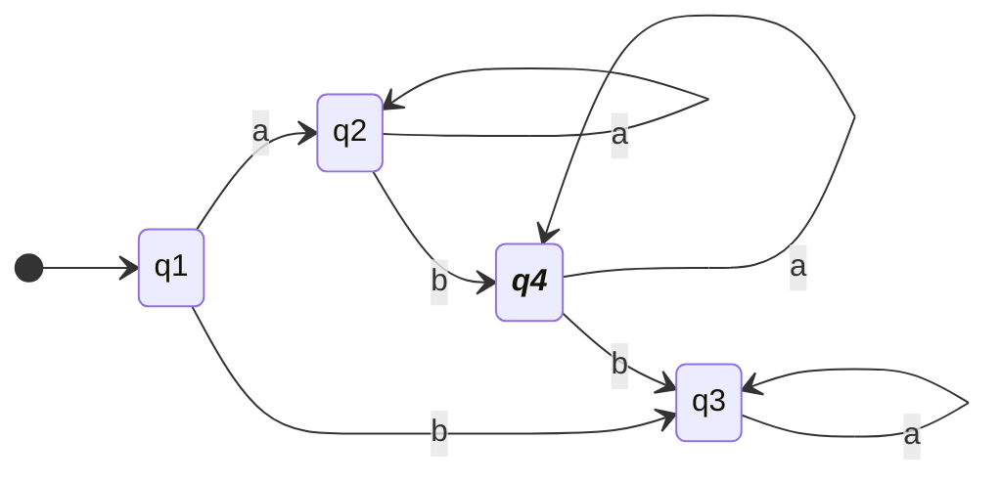
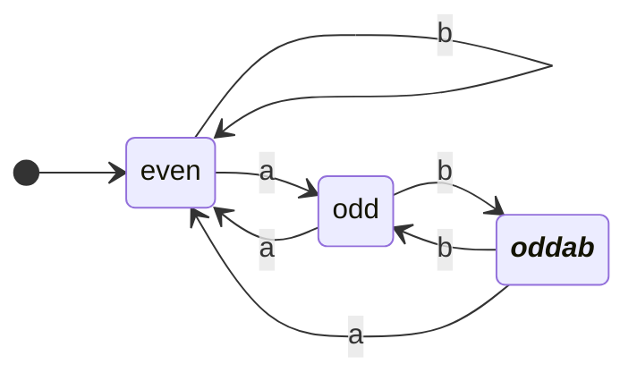
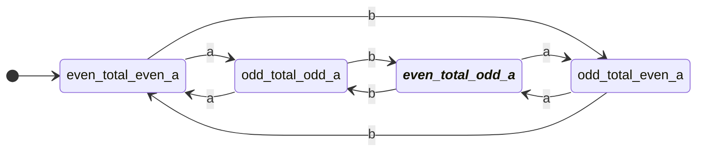
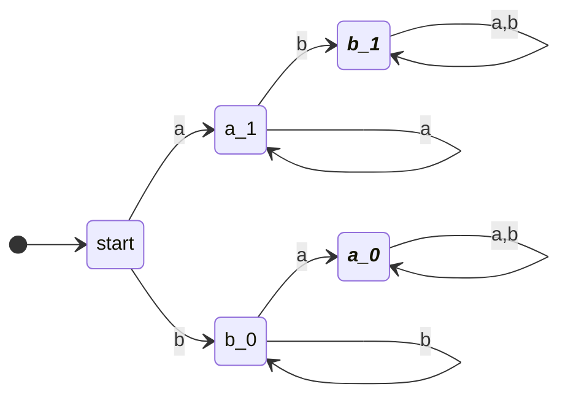
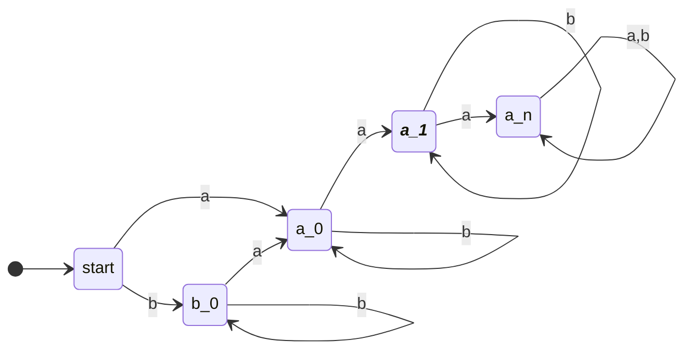
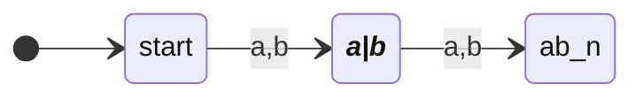
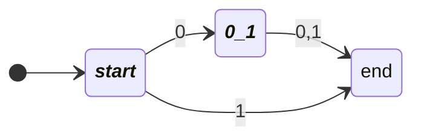
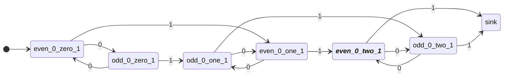

# 4011 Formal Language and Autonoma- Assignment 1
### Austin Lyksett 
### Date: 2023-09-14
### Discussion 5

---


 #### 1.3 Give the state diagram of the following machine:
  
|       | $\text{u}$ | $\text{d}$ |
| ----- | ---------- | ---------- |
| $q_1$ | $q_1$      | $q_2$      |
| $q_2$ | $q_1$      | $q_3$      |
| $q_3$ | $q_2$      | $q_4$      |
| $q_4$ | $q_3$      | $q_5$      |
| $q_5$ | $q_4$      | $q_5$      |





---

### 1.4 Construct the state diagram for the following definitions:

- e) $\text{w | w starts with a and has at has at most one b}$:
   - I figured I could use the concept of a local sink in order to reject strings that wouldn't be accepted, $q_3$. From the start, if the string starts with a b then we can direct it to the local sink.
   - If the string starts with an a, then the only thing we're concerned about is the number of b's left in the string (self loop on `a`). If we encounter a `b` then move to the accepting state (since this is the first b). From here, self loop for every `a`, and if there is a `b` read, then move to the local sink (reject).



- f)  $\text{{w| w has an odd number of a’s and ends with ab}}$
   - I think it's useful to think in terms of the accepting state. The only way we can move into the accepting state is if we read a `b` **when there's an odd number of `a`**. Instead of checking every `ab`, we can just have a local cycle for even/odd a's like we've seen before, but on instances of `current: odd, next symbol: b` we mode in to the accepting state. The accepting state is an "alternate" version of the `odd` state below.



- g) $\text{ w| w has even length and an odd number of a’s}$
  - Given 0 is even
  - There's two main bits of information we need to track; the parity of the string so far and the parity of the number of a's. If we create sets for the states of these two respectivley, `{even_total, odd_total}`, `{even_a, odd_a}` and we use the cartesian product of these two, then we can represent all relavent states.
  - The graph will basically track the total's parity and `|a|`'s parity
    - On any symbol, move the total parity to the next state (`even_total_... --> odd_total_...`), and depending on what symbol is read (`a, b`), move to the appropriate a's parity state. (`if even_total_odd_a, read(a), then odd_total_even_a`). Update parity of both bits.



### 1.5 Constrict the state diagram for the simpler language
- c) $\text{w | w contains neither the substrings ab nor ba}$
    - For every string in a language composed of `a,b`, if it were be casted to a set the result would be one of  `{a, b, ab, ba}`. We can exploit this by creating a diagram that only accepts a string if it's of a unique symbol.
    - Again, I'm using the concept of local sinks to reject bad strings. 
    - The problem states that we need to find the complement of the machine described above, so we can just negate the accepting states.





- g) $\text{w | w is a string that doesn't contain exactly two a's}$
   - Translation into complement: $\text{w | w is a string that contains two a's}$
   - It's pretty straightforward to construct a machine that will track the number of a's. self loop on `b` and create n nodes for `desired a's + 1` (+1 for a local sink)



- h) $\text{w | w is any string except a and b}$
  -  Note: $\text{a and b} \neq \text{ab}$
  - Therefore, we want to build a machine that accepts only strings 'a', or 'b'
  - Again, using a local sink to reject bad strings.


### 1.6
- k) $\{\epsilon, 0\}$
  - $\epsilon$ will be accepted by the start node.
  - Then we just need to follow the `desired+1` to track the `desired` number of symbols.


- l) $\text{w | w contains an even number of 0s, or contains exactly two 1s}$
  - This one is less graceful but let's again think of it in from the accepting state. 
  - Let $\text{F=\{even\_0\_two\_1\}}$
  - Similar to what we saw in 1.4g and 1.5g, there are now three bits of information (parity of zeros, number of 1's), then plus 1 for a sink since we're tracking a desired number again (doesn't need to be tracked as a bit since it wont store any more information).
  - The states are represented in this table
  
  |              | zero 1's      | one 1        | two 1's      |
  | ------------ | ------------- | ------------ | ------------ |
  | odd # zeros  | odd_0_zero_1  | odd_0_one_1  | odd_0_two_1  |
  | even # zeros | even_0_zero_1 | even_0_one_1 | even_0_two_1 |

  - The cartesian product of these two sets is 6, so we have 6 states, plus the sink giving 7.
  
  - There are two criterion by which we can be in this state: Even number of zeros, two 1's.
  - Therefore there's two states that would preceed being in this accepting state:
    - odd_0_two_1
    - even_0_one_1
  - From here, we can keep working back *what states would preceed these two*. This may not be an ideal solution, especially if the alphabet and states increase but it's a pretty limited problem.




- m) $\emptyset$
  - if any symbols are read, then reject
  - Note, the starting black circle is the accept state
 ```mermaid
 stateDiagram-v2
 Direction LR
 classDef acceptState font-style:italic,font-weight:bold
    [*] --> sink: 0,1

 ```
