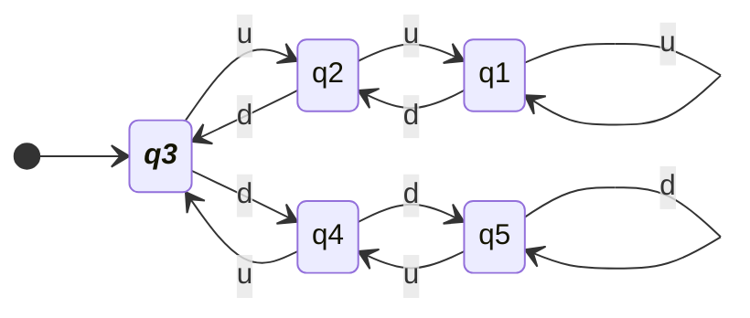
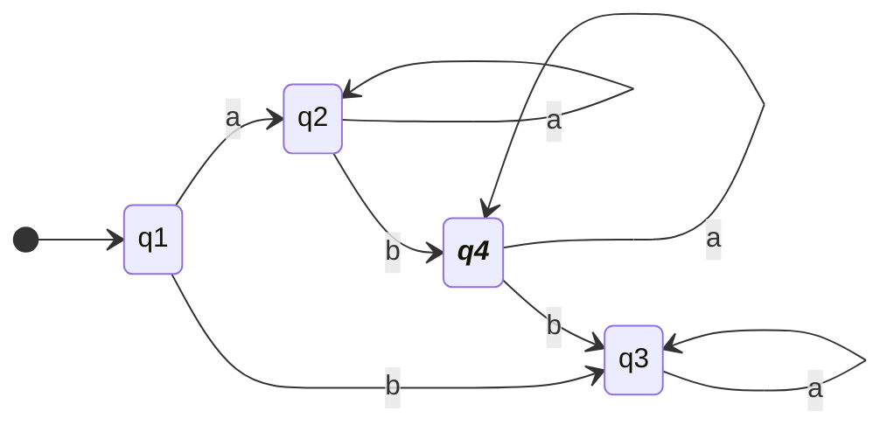
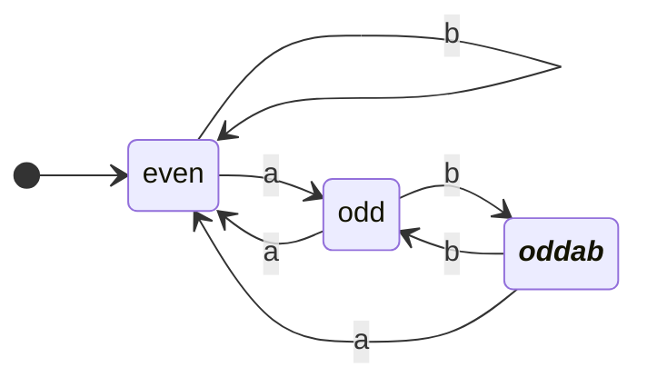
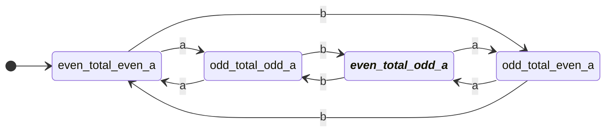
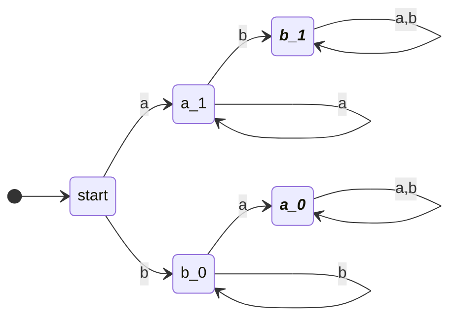
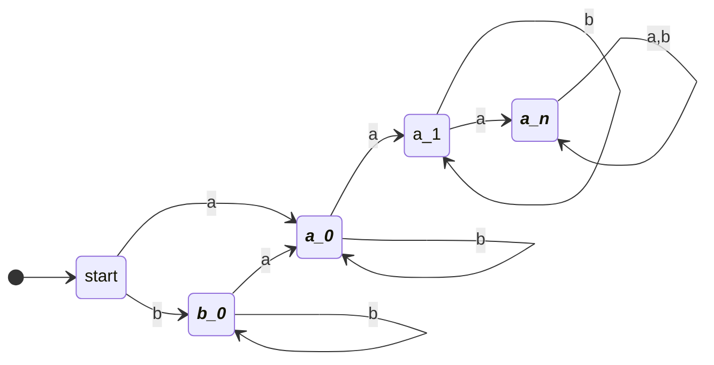
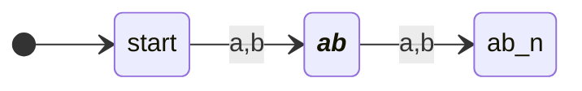
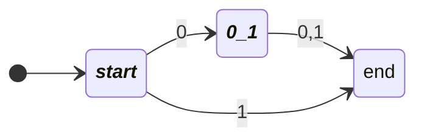
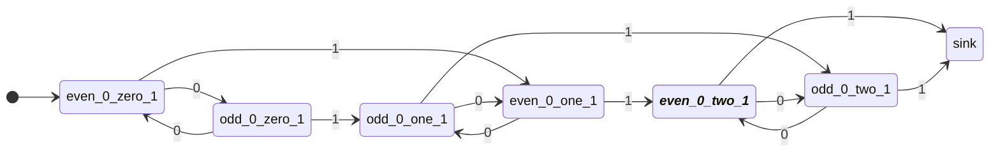

# 4011 Formal Language and Autonoma- Assignment 1
### Austin Lyksett 
### Date: 2023-09-14

---


 #### 1.3 Give the state diagram of the following machine:
  
|       | $\text{u}$ | $\text{d}$ |
| ----- | ---------- | ---------- |
| $q_1$ | $q_1$      | $q_2$      |
| $q_2$ | $q_1$      | $q_3$      |
| $q_3$ | $q_2$      | $q_4$      |
| $q_4$ | $q_3$      | $q_5$      |
| $q_5$ | $q_4$      | $q_5$      |



---

### 1.4 Construct the state diagram for the following definitions:

- e) $\text{w | w starts with a and has at has at most one b}$:




- f)  $\text{{w| w has an odd number of a’s and ends with ab}}$




- g) $\text{ w| w has even length and an odd number of a’s}$
  - Given 0 is even
  - odd_total_... will always go to even_total_...
  - ..._even_a will always go to ..._odd_a on an `a`



### 1.5 Constrict the state diagram for the simpler language
- c) $\text{w | w contains neither the substrings ab nor ba}$
    - This definition states there can only ever be a sequence of a's, or a sequence of b's



- g) $\text{w | w is a string that doesn't contain exactly two a's}$




- h) $\text{w | w is any string except a and b}$
  - $\text{Therefore, we want to build a machine that accepts only strings 'a', or 'b'}$


### 1.6
- k) $\{\epsilon, 0\}$



- l) $\text{w | w contains an even number of 0s, or contains exactly two 1s}$




- m) $\emptyset$
    - Note, the starting black circle is the accept state
 ```mermaid
 stateDiagram-v2
 Direction LR
 classDef acceptState font-style:italic,font-weight:bold
    [*] --> sink: 0,1

 ```

```


```