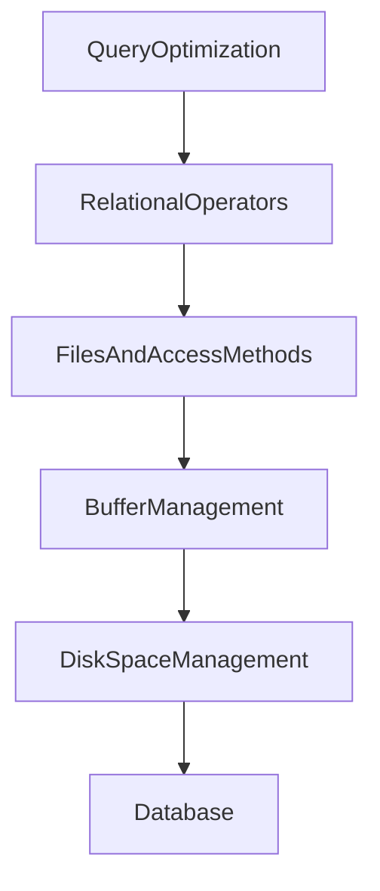

# 4707 Practice of Database Systems
### Austin Lyksett
### Date: 2023-09-07

---

Files vs DBDMS

Different types of view of a DB:
- Conceptual:
    - `Students(sid: str, name: str ...)`
    - `Courses(cid: str, name: str ...)`
    - `Enrolled(sid: str, cid: str ...)`
- Physical Schema:
    - Relations stored as unordered files
    - Index on first column of Students
- External Schema (View)
    - What you're able to see. The end result from FAC

Why not make a large table? E.g `(sid, student, cid, cname, gpa, login ...)`? 

Because one column can have several of another

Unless you fill with the same data:
|student|class|gpa|cid|
|---|---|---|---|
|Austin|4707|4.0|123
Austin|4011|4.0|123
Austin|5701|4.0|123
Austin|4531|4.0|123


Lots of repeats here

__Concurrency Control__

Consider these two transactions;
```
    T1: BEGIN A = A+100,  B = B-100  END
    T2: BEGIN A = 1.06*A, B = 1.06*B END
```

These operations are not commutative.
1. T1, T2 --> A = 318, b = 108
2. T2, T1 --> A - 312, b = 112


We have some options doe:
```
Option 1:
T1: A += 100        B-=100              A = 318
T2          A*=1.06         B*=1.06     B = 106

Option 2: 
T1: A += 100                B*=1.06     A = 318
T2          A*=1.06  B-=100             B = 112
```

Option 2 is WRONG since it doesn't allign with any of the old ones, therefore we go for option 1.

____BUT____ Remember about time. If you think about it like R(A|B), W(A|B) then some reads will not be performing in the correct order even if looks right like above (option 2)

DBMS ensure _atomicity_ (all or nothing) even if a system crashes.

We can do this by logging BEFORE we write or read, that way the log of all transactions exist before the crash.

Structure of DBMS: 




    
    


