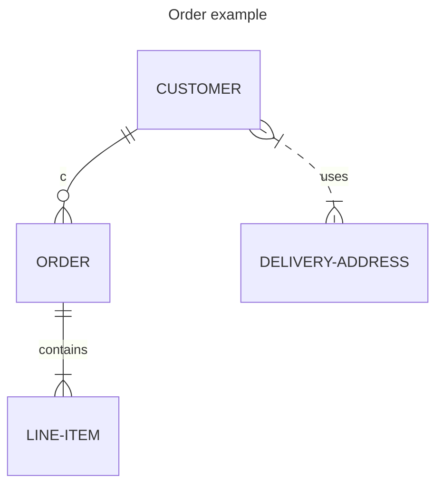
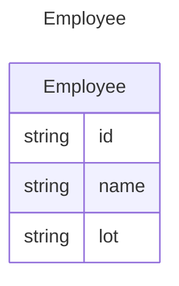
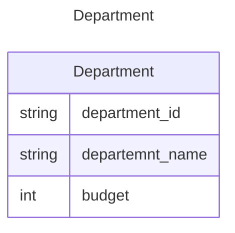
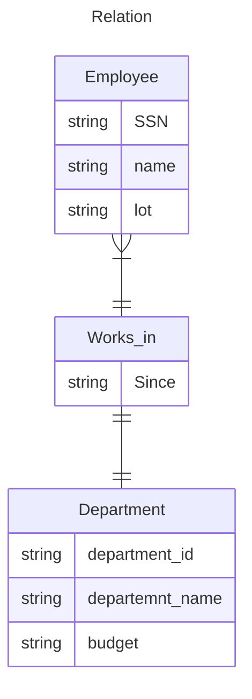
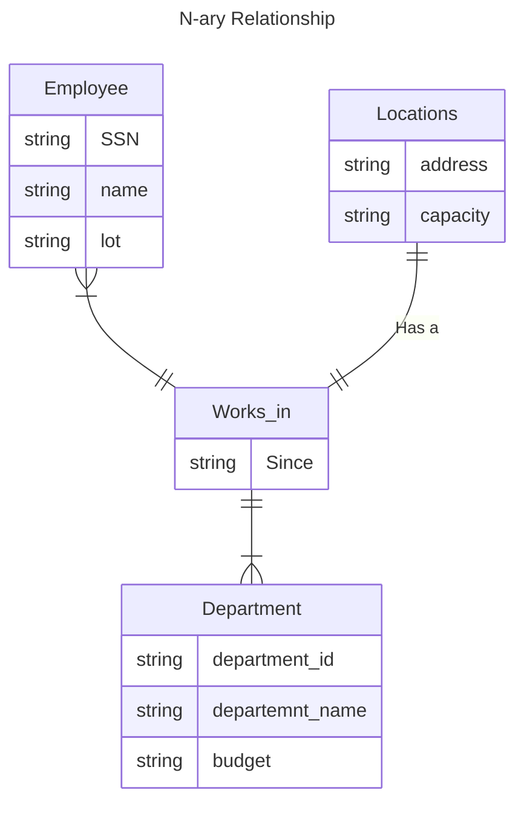
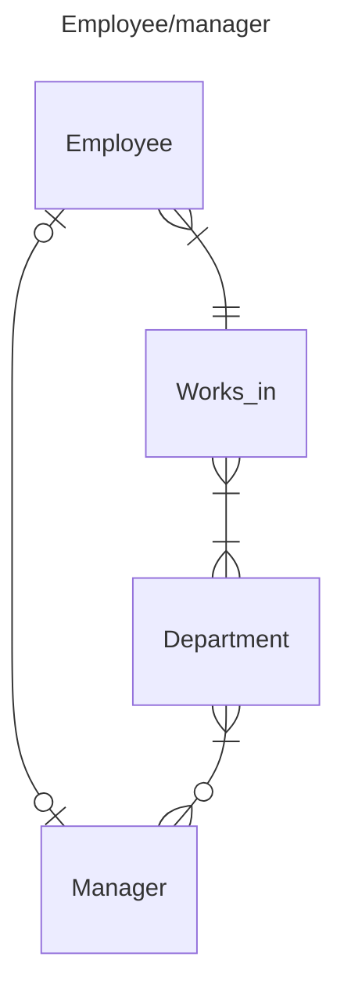

# 4707 Practice of Database Systems
### Austin Lyksett
### Date: 2023-09-12

---

### The Entity-Relationship Model

Conceptual design: (ER Model is used at this stage)
- What are the entities and what are the retlationships?

***Entity***
- Real world object distinguishable from other objects
- An entity is described as a set of *attributes* 
***Entity set***
- A collection of similar entities, eg students
- Each entity set has a key
- Each attribute has a *domain*

| ID  | GPA | Name   | Credits | Email            |
| --- | --- | ------ | ------- | ---------------- |
| 000 | 4.0 | Austin | 15      | lykse010@umn.edu |
| 001 | 3.9 | Bob    | 14      | bob123@umn.edu   |
| 113 | 3.1 | Tom    | 12      | tom444@umn.edu   |

ID is a **KEY**. The one thing that garuntees no two entities will be the same. There may be other keys-- email for example could also be a unique key.

You tell the builder of the DB that SSN is unique and will be the key, builder will translate that into a table;

| SSN | Name | lot |
| --- | ---- | --- |
| ... | ...  | ... |
| ... | ...  | ... |
| ... | ...  | ... |

We can also have departments;

key: minimum set of attributes that can uniquely identify any entity.
* if there are more than one candidate keys, then one of them is the primary key.

* underline key in the diagram.

- Choosing the right key is important -- the key WILL order the data and that does make a difference.

- Make the choice based on the customer. For example with students, what does the Uni use more to do searches? Email or Student ID etc.

---

Now we create associations by RELATION

---

N-ary Relationship

An n-ary relationship set R relates n entity sets E1.. En. Each relationship in R involves e1 ... en

The entity set in a relation may not be distinct.
- An employee can supervise another employee
- In this case, a role indicator should be lebeled (supervisor, subordinate)
- Same entity set could participare in different relationship sets, or in different 'roles' in the same set.

- *Diamond box is a relationship.*

What about in cases where a set has a single thing?
- eg a departemnt has many employeed, but at most one manager

Use an arrow

- Many-to-Many
  - Works-in: One employee may work in more than 1 depts. One department may have more than 1 employee.
- 1-to-many
  - Manages: A department is managed is only one manager, however one employee can manage more than one department
- Many-to-1
  - Works-in: If we add a constraint that each employee can work only in one department
  - It's previous is Many-to-many
- 1-1
  - Manages: If we add a constraint that one employee can only manage one department
  - It's previous is 1-to-many

Note: Abiding by this so rigidly can be annoying in the real world.

### Paritipation Constraints

- Does every departemnt have a manager?
  - If so, this is a participation constraint: the participation of departments in manages is said to be *total (vs partial)*
    - Every dID value in Departments table must appear in a row of the manages table (with a non-null SSN)

