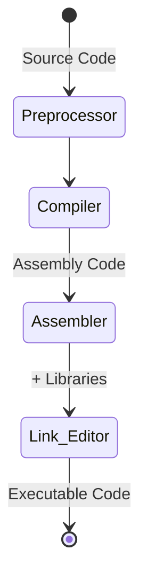

# 5106 Programming Languages, C Program Compilation
### Austin Lyksett
### Date: 2023-09-16

---

## Compiling a program

There are different compilers for C. One common one for GNU C is `gcc`, another is `cc` which is provided by Sun

The basic way to compile a C program is the command `gcc program.c`. After this happens, the compiled version of your program is created in the same directory, called `a.out`. You can use the `-o` flag to overwrite this `a` file name;

`gcc -o program program.c`. 

To run the executable in UNIX, simply type the name of the out file.

## C Compilation model




### The Preprocessor
- The Preprocessor accepts source code as input and is responsible for doing things such as
  - removing comments
  - interpreting special *preprocessor directives*, denoted by #.
- For example:
  ```C
    // "# include" includes contents of a named file. Files usually called *header* files, eg:
    # include <math.h>
    # include <stdio.h> // standard library IO file.
    // "# define" defines a symbolic name of constant, macro substitution
    # define MAX_ARRAY_SIZE 100 
  ```

### C Compiler 
- The C compiler translates source to assembly code. The source code is recieved from the preprocessor

### Assembler
- The assembler creates objcet code. On UNIX systems these files are denoted with a `.o` extension

### Link Editor
- If a source file references library functions or functions defined in other source files, the  link editor combines these functions (with main()) to create an exec. file. External vars are also resolved here.


## Some useful compiler options

- `-c` will supress the linking process and will produce a .o file for each source file listed. Several can be linked by the `cc` command also, for example 
  ```cc file1.o file2.o ... -o executable```


- `llibrary` will link objects with libraries. This option must follow the source file arguments.
  ```cc calc.c -o calc -lm```

- `Ldirectory` Will add a directory to the list of directories containing object-library routines. The linker will always look for std libs in /lib and /usr/lib. If you want to link libraries that you have created or installed yourself, you will have to specify where the files are stored:
  ```cc prog.c -L/home/myname/mylibs mylib.a```

- `Ipathname` Will add pathname to the list of dirs in which to search for `#include` files with relative filenames (relative = not containing `/`)
  - By default, the preprocessor first searches for `#include` files in the dir containing the source file, then in dirs named with `-I` options, and finally, in `usr/include` So to include header files stored in `/home/myname/myheaders` you would do:

    ```cc prog.c -I/home/myname/myheaders```

- `-g` Invokes debugging option. This instructs the compiler to produce additional symbol table iformation that is used by a variety of debugging utilities
- `-D` defines symbols as either identifies, or as values. `-Didentifier, -Dsymbol=value`. This is simular to `#define` 

## Finding information about library functions
- You can use `man 3 <func>` in terminal to get a little rundown
- Or for a larger list, do `man 3 intro`

## Lint- A C program verifier

- C can be pretty vague, type checking can get faffy so a way to verify this is to use lint, by
- `lint myprog.c`. 
- use `man lint` for more info
---

# SUMMARY:

- To compile a program:
  
`gcc -o outname filename.c`
  - Which will create the .o file
  - Then you run it using 
  
`./outname`

