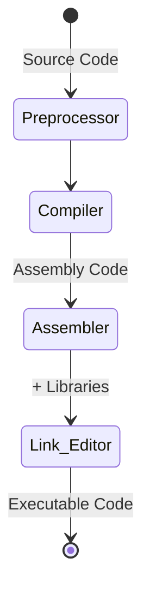

# 5106 Programming Languages, C
### Austin Lyksett
### Date: 2023-09-16

---

## Compiling a program

There are different compilers for C. One common one for GNU C is `gcc`, another is `cc` which is provided by Sun

The basic way to compile a C program is the command `gcc program.c`. After this happens, the compiled version of your program is created in the same directory, called `a.out`. You can use the `-o` flag to overwrite this `a` file name;

`gcc -o program program.c`. 

To run the executable in UNIX, simply type the name of the out file.

## C Compilation model




### The Preprocessor
- The Preprocessor accepts source code as input and is responsible for doing things such as
  - removing comments
  - interpreting special *preprocessor directives*, denoted by #.
- For example:
  ```C
    // "# include" includes contents of a named file. Files usually called *header* files, eg:
    # include <math.h>
    # include <stdio.h> // standard library IO file.
    // "# define" defines a symbolic name of constant, macro substitution
    # define MAX_ARRAY_SIZE 100 
  ```

### C Compiler 
- The C compiler translates source to assembly code. The source code is recieved from the preprocessor

### Assembler
- The assembler creates objcet code. On UNIX systems these files are denoted with a `.o` extension

### Link Editor
- If a source file references library functions or functions defined in other source files, the  link editor combines these functions (with main()) to create an exec. file. External vars are also resolved here.


## Some useful compiler options

