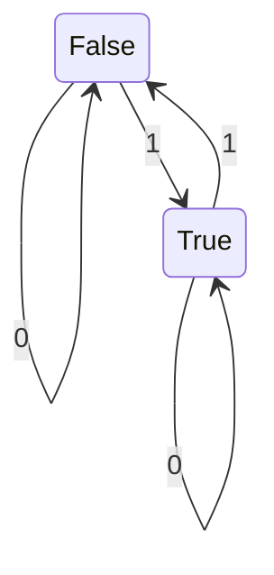
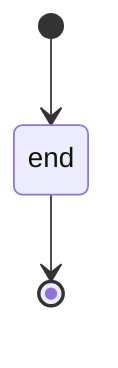

# Examples
## Diagrams

### State Diagrams

## LaTeX
[Symbols cheat sheet](https://www.cmor-faculty.rice.edu/~heinken/latex/symbols.pdf
)

### Set theory
`$\in$` : $\in$
`$\notin$` : $\notin$
`$\subset$` : $\subset$
`$\subseteq$` : $\subseteq$
`$\forall$` : $\forall$
`$\exists$` : $\exists$
`$\nexists$` : $\nexists$
`$\emptyset$` : $\emptyset$
`$\mathbb{N}$` : $\mathbb{N}$
`$\mathbb{Z}$` : $\mathbb{Z}$

https://jojozhuang.github.io/tutorial/mermaid-cheat-sheet/
